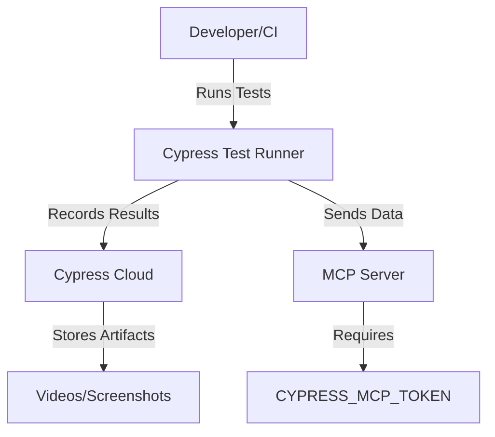

# Cypress Cloud MCP

## Overview

Cypress Cloud Model Context Protocol (MCP) server gives AI coding assistants a direct window into your application’s health and stability by connecting directly to Cypress Cloud.

By eliminating the context gap between CI and your editor, you remove the manual triage that makes testing a bottleneck. Cloud MCP gives your AI agent real-time access to your test results. It allows agents to query run statuses, identify flaky tests, and retrieve failure details—including Test Replay links—directly within your agentic workflow.

**Official Documentation:**  
https://docs.cypress.io/cloud/integrations/cloud-mcp#Configuring-the-Cloud-MCP

---

---

## How it Works
The Model Context Protocol (MCP) is an open standard that enables AI models to safely access external data and tools.

Think of MCP as the "USB port" for AI. Just as a USB port allows any peripheral to connect to any computer, MCP allows your AI assistant (the Host) to plug into Cypress Cloud (the Server) to fetch real-time context.

- **The Host:** Your AI client (like Cursor, Claude Desktop, or VS Code).
- **The Server:** A remote service hosted by Cypress that retrieves Cloud data for the AI.
- **The Connection:** A secure pipe authenticated by your personal access token.

---

## Prerequisites
- Node.js (v14 or above)
- npm (v6 or above)
- Docker (for containerized runs)
- Cypress Cloud account (for recording runs)
- Cypress MCP personal access token

---

---

## Configuring the Cloud MCP

To use the Cloud MCP:

1. **Enable integration:** An admin will need to enable the integration for your organization (see Integrations page in Cypress Cloud).
2. **Generate personal access token:** Each user must create a personal access token (PAT) to authenticate with Cloud MCP.
3. **Configure AI:** Each user must add the remote MCP configuration to their preferred AI client.

### Generate Personal Access Token
1. Sign in to Cypress Cloud.
2. In the upper-left corner, click your organization picture.
3. Select **Manage Profile**.
4. Under MCP personal access token, click **Generate token**.
5. Select an expiration and click **Continue**.
6. Copy the token immediately—it is only shown once.

The token access is scoped to your role and permissions in each MCP-enabled organization.

### Configure AI Assistant
Configure your agent or AI client to connect to Cloud MCP. The remote URL is: `https://mcp.cypress.io/mcp`. Set the authorization header with `Bearer <CYPRESS_MCP_PAT>`.

Supported clients include:
- Antigravity
- Claude Desktop
- Claude Code (CLI)
- Cursor
- GitHub Copilot in VS Code
- GitHub Copilot CLI
- OpenAI Codex CLI

For other AI clients, refer to their documentation for configuring a remote MCP connection.
```
cypress.config.js         # Cypress configuration
Dockerfile                # Docker setup for CI/CD
package.json              # Project dependencies and scripts
.vscode/mcp.json          # MCP configuration
cypress/
  e2e/                    # Test specs (cart, checkout, inventory, login)
  fixtures/               # Test data (example.json)
  support/                # Custom commands and support files
  videos/, screenshots/   # Cypress artifacts
```

---

---

## Project Structure

### 1. Clone the Repository
```sh
git clone <repo-url>
cd CypressCICD
```

### 2. Install Dependencies
```sh
npm ci
```

### 3. Configure MCP
- Open `.vscode/mcp.json` and ensure the `CYPRESS_MCP_TOKEN` input is set up.
- When prompted, enter your Cypress MCP personal access token.

### 4. Run Cypress Tests Locally
```sh
npm run cy:open   # Interactive mode
npm run cy:run    # Headless mode
```

### 5. Run in Docker (CI/CD)
```sh
docker build -t cypresscicd .
docker run -e CYPRESS_RECORD_KEY=<your-key> cypresscicd
```

### 6. Record Runs to Cypress Cloud
```sh
npx cypress run --record --key <your-cypress-record-key>
```

---

---

## MCP Configuration Example
- `.vscode/mcp.json` configures the MCP server and token prompt for secure cloud integration.
- Example:
```json
{
  "servers": {
    "cypress": {
      "type": "http",
      "url": "https://mcp.cypress.io/mcp",
      "headers": {
        "Authorization": "Bearer ${input:CYPRESS_MCP_TOKEN}"
      }
    }
  },
  "inputs": [
    {
      "id": "CYPRESS_MCP_TOKEN",
      "type": "promptString",
      "description": "Enter your Cypress MCP personal access token",
      "password": true
    }
  ]
}
```

---

---

## Available Tools

Once connected, your AI agent can autonomously use the following tools (the agent selects them based on your prompt):

| Tool                        | Capability                                                        | Best Use Case                                      |
|-----------------------------|-------------------------------------------------------------------|----------------------------------------------------|
| cypress_get_projects        | Lists all projects in your Org.                                   | Helping the agent find the correct projectId.       |
| cypress_get_runs            | Returns run summaries for a project, run URL, or git branch.      | "Check the status of the last CI run on main"      |
| cypress_get_failed_test_details | Retrieves attempt details: test name, spec, error, stack trace, and Test Replay link. | "Analyze why the checkout test failed in the latest run." |
| cypress_get_flaky_tests     | Identifies the flaky tests in a run.                              | "Are these failures regressions or known flakiness?" |
| cypress_feedback            | Shares feedback with Cypress directly from your agentic environment. | "Report a bug or request a new MCP feature."      |

---

## Writing Effective Prompts

To get the most out of Cloud MCP, follow these three principles:

1. **Trigger Explicitly:** Use the phrase "Cypress Cloud" to ensure the agent looks for the correct MCP tools.
2. **Provide Context:** Mention "this branch," "this commit," or paste a Run URL directly.
3. **Define the Workflow:** Don't just ask what failed; ask the agent to fix it.

### Example Prompts

- **The Health Check:**
  > Check Cypress Cloud for the latest run on this branch. Give me a high-level summary of any failures.

- **The Deep Debug:**
  > Find the failing tests for [Run URL]. For each failure, look at the stack trace, check my local code, and propose a fix to stop the regression.

- **The Flake Audit:**
  > List all flaky tests from the last 5 runs in Cypress Cloud. Are there any common patterns in the error messages?

**Pro-Tip:** If you find a workflow that works well, save it as a Custom Instruction or Skill in your AI client to standardize debugging for your entire team.

---
- The project uses a prompt for the Cypress MCP token to keep credentials secure.
- You will be prompted for this token when running tests that interact with MCP.

---


## Architecture Block Diagram



### Block Explanations & Benefits
- **Developer/CI**: Triggers test runs locally or in CI/CD pipelines.
- **Cypress Test Runner**: Executes e2e tests, can run locally or in Docker.
- **Cypress Cloud**: Centralized dashboard for test results, analytics, and artifacts.
- **MCP Server**: Handles secure communication and integration with Cypress Cloud, requiring a token for authentication.
- **CYPRESS_MCP_TOKEN**: Ensures only authorized users can record/manage runs.
- **Videos/Screenshots**: Artifacts for debugging and reporting.

---

-## VIDEOS

### Demo Video
A demo video is included in the `cypress/videos/` directory. This video demonstrates the Cypress Cloud MCP workflow and test execution. Review it for a step-by-step visual guide to running and analyzing tests with Cypress Cloud MCP.

---

## Benefits
- **Automated Testing**: Ensures application quality with every change.
- **Cloud Integration**: Centralized results and analytics.
- **Secure Credentials**: Token-based authentication for cloud operations.
- **Easy CI/CD Integration**: Docker and npm scripts for seamless automation.
- **Debugging Artifacts**: Videos and screenshots for fast issue resolution.

---


